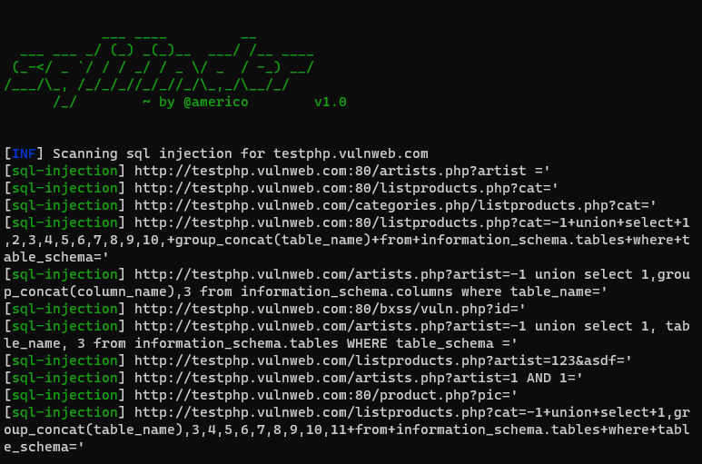

<h1 align="center">
  </a>
  <br>
</h1>

<h4 align="center">SQL Injection scanner made with python.</h4>


      
<p align="center">
  <a href="#features">Features</a> •
  <a href="#installation">Install</a> •
  <a href="#running-sqlifinder">Usage</a> •
</p>

---


sqlifinder is a tool with the function of detecting GET-based sql injection vulnerabilities in web applications using waybackurls, web crawlers and sql injection payloads.


# Features

<h1 align="left">
  </a>
  <br>
</h1>


 - Fast and powerful scanner
 - Include web crawler and waybackurls


# Usage

```sh
python3 sqlifinder.py -h
```
This will display help for the tool. Here are all the switches it supports.


# Installation

Sqlifinder requires:
- python3
- huepy
- requests
- tqdm

To install run these comands:
```sh
▶ sudo apt install git
```
```sh
▶ git clone https://github.com/americo/sqlifinder
```
```sh
▶ cd sqlifinder
▶ pip3 install -r requirements.txt
```


# Running Sqlifinder

To run the tool on a target, just use the following command.
```sh
▶ python3 sqlifinder.py -d example.com
```


The `-s` command can be used to test sql injection in subdomains of the target.

```sh
▶ python3 sqlifinder -d example.com -s
```


# License

sqlifinder is made with 🖤 by the [americo](https://americojunior.com).

